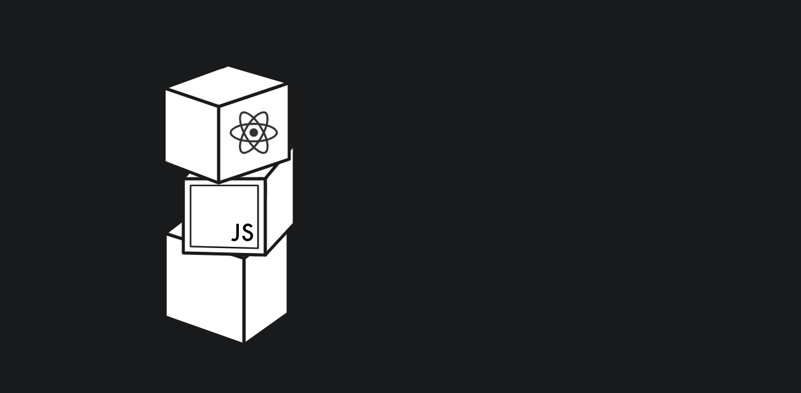
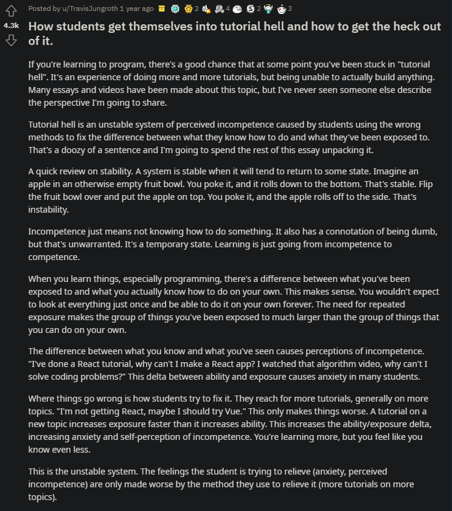

_Merely another bootcamp..?_

<!--more-->

## Dear Reader

[Full Stack Open](https://fullstackopen.com/en/) is now a milestone in my [developer journey](https://junsunglee.com/ConsenSys-Blockchain-Developer-Bootcamp/)! 

If you're anything like me, you've likely experienced repeated failed attempts to escape the gravity of tutorial hell:

I've tried [The Odin Project](https://www.theodinproject.com/), [freeCodeCamp](https://www.freecodecamp.org/), [Codecademy](https://www.codecademy.com/), and other resources, but perhaps that was my problem. A panoply of free online courses = [decision fatigue](https://en.wikipedia.org/wiki/Decision_fatigue).
The sparse instructions and difficult-yet-attainable milestones is an encouraging work of faith, labor of love, and patience of hope ([1 Thessalonians 1:3](https://www.biblegateway.com/passage/?search=1%20Thessalonians%201&version=KJV)).

Things that really gave me a hard time:
- async / await
- testing
- wrapping returned Objects in parentheses
- spread operator
- scope of the arrow function
- toggleable

---

## Context

#### Point1

#### Point2

#### Point3

## Conclusion

You can reach me with thoughts/questions at <jun@junsunglee.com>.

---

## CODA

_Pithy quote_

-- Wise Man, [_Reference_](https://google.com)

---

#### Recommended Reading:
- _[Learning React (2nd Edition)](https://www.amazon.com/Learning-React-Modern-Patterns-Developing/dp/1492051721)_ by Alex Banks and Eve Porcello
Despite the noticeably negative reviews on Amazon, I found the book to be an excellent supplement to the fullstackopen curriculum.
- Philippians 4:13