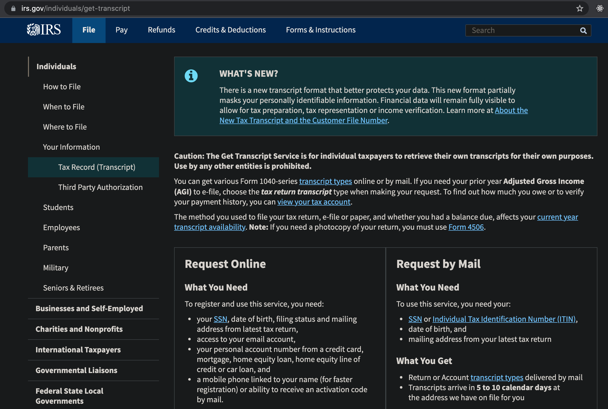

_Lest you discover yourself the proverbial turkey on Thanksgiving..._

<!--more-->

## Dear Reader

Working at [Precision Tax](https://www.precisiontax.com), I've gained wisdom not easily found in the typical accounting firm. We specialize in clients struck by a [grey swan](https://www.investopedia.com/terms/g/grey-swan.asp#:~:text=Grey%20swan%20is%20a%20term,low%20perceived%20likelihood%20of%20happening) event: receiving the dread IRS letter. Every client admits that they didn't think it would happen to them.

If you fail to file your taxes every year, you're exposing yourself to the risk of an IRS confrontation to which you'll have no right to contest until "becoming compliant" (making sure every return for the past five years has been filed). The nightmare merely begins as you scramble to find receipts and tax documents spanning half a decade (with no statute of limitations in the case of [fraud](https://www.investopedia.com/terms/t/tax-fraud.asp#:~:text=Tax%20fraud%20essentially%20entails%20cheating,number%3B%20and%20not%20reporting%20income)).

In addition to the prudence of safekeeping your prior year returns, possessing your [IRS transcripts](https://www.irs.gov/individuals/get-transcript) will greatly aid in resolving scuffles with the Tax Man should they occur.

---

## What transcripts?

There are two types of cases at my firm - those we're able to help and those that get canned - and the most effective indicator of a case being favorably resolved is the presence of [IRS transcripts](https://www.irs.gov/individuals/get-transcript). The transcripts are records generated for each registered taxpaying entity and a primary reference for the IRS on any case.

There are several types of transcripts, but the three you should have handy are:

#### Account (AT)

Any Covid stimulus payments issued to you will have their amounts listed in the AT. In case you forgot how much you received or you're tempted to lie about not receiving any checks, you can review your current year AT.

#### Wage & Income (WT)

Your federal W-2 and 1099 info will show up here. Unless you [primarily reside](https://www.investopedia.com/terms/p/principalresidence.asp) in a [state with no income tax](https://www.investopedia.com/financial-edge/0210/7-states-with-no-income-tax.aspx), you'll also want to keep records of actual tax documents from employers/providers since they'll have state withholding amounts (taxes already paid to your home state) which could reduce your state tax liability (IRS transcripts only contain information relevant for your federal returns).

#### Return (RT)

This is a record of any tax returns you've filed. The IRS currently holds copies for the past three tax years, but this rolling statute of limitations means your oldest available return will vanish at the beginning of the new year (as of writing, 2017 RTs are available until Dec 31, 2021). If the IRS corners you for a return outside that three-year window and you don't have a copy readily available - sadistically, they'll have said information now withheld from you - you're not going to have a good time. It would be wise to setup a yearly reminder to check if you have their [oldest available transcript](https://www.irs.gov/individuals/get-transcript).

## Warning

Keep in mind: the IRS is an unelected bureaucratic entity, responding to every issue with disproportional federal force to scare others from breaking the law. Where other arms of the government may fail, the IRS manages to steadily fell those with even platinum-grade defense teams ([Al Capone](https://en.wikipedia.org/wiki/Al_Capone#Tax_evasion), [John Gotti](https://en.wikipedia.org/wiki/John_Gotti#1992_conviction), etc.).

I'm no proponent of the IRS or other unelected bureaucracies. My motive for tax work is to equip clients to be more citizen, less prey. Unless you enjoy shelling large sums to firms like [Precision Tax](https://www.precisiontax.com), do your due diligence to avoid showing up on the IRS radar.

Get your transcripts: https://www.irs.gov/individuals/get-transcript

You can reach me with thoughts/questions at <jun@junsunglee.com>.

---

## CODA

_If you have been having trouble with the tax authorities and you receive an official piece of mail from their agency, your blood pressure will increase or drop precipitously. Your heart will pound, your palms will sweat, and a feeling of intense fear (even doom) will sweep over you._

-- Jordan B. Peterson, [_Beyond Order_](https://www.amazon.com/Beyond-Order-More-Rules-Life/dp/0593084640)
