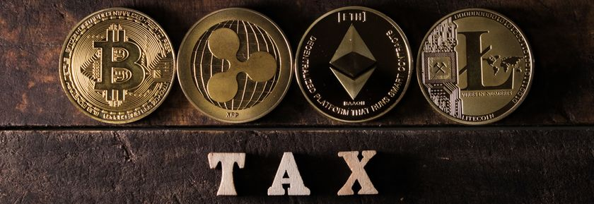
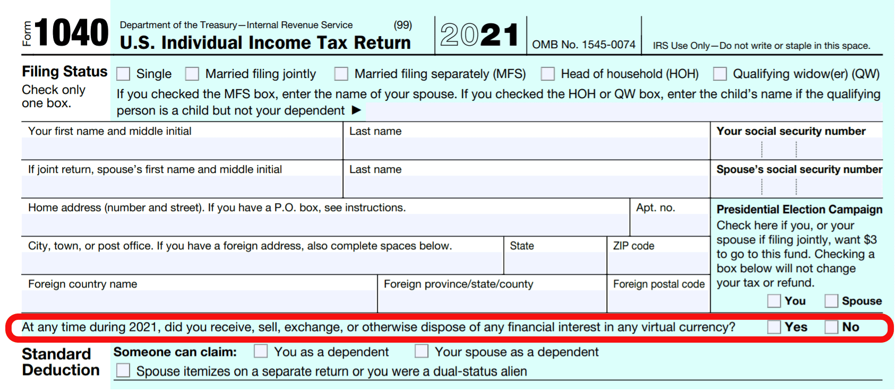
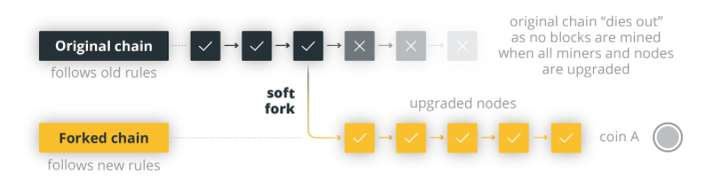
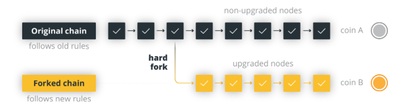
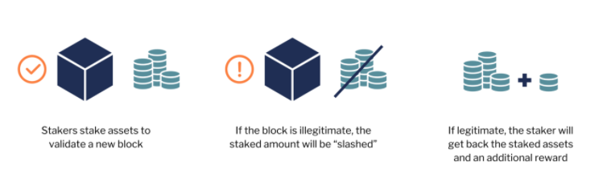

_I didn't get the form, so it's not taxable, right?_

<!--more-->

## Dear Reader

In 2015, the IRS reported only 800-900 taxpayers reported their crypto transactions. In 2016, Coinbase was ["John Doe" summoned](https://www.justice.gov/opa/pr/court-authorizes-service-john-doe-summons-seeking-identities-us-taxpayers-who-have-used) by the IRS. The Court narrowed the summons to only those customers who bought, sold, or received more than $20,000 bitcoin in any one year -- [2013, 2014, or 2015](https://junsunglee.com/Get-Your-IRS-Transcripts-NOW/). Coinbase emailed 13,000 of their customers informing them that their names, TINs, DOB, addresses, records of activity, and statements of accounts would be handed over to the IRS.

In a 2019 Bloomberg National Survey, an estimated 14% of Americans owned cryptocurrency in some form. Today, that estimate is about 60-70% and mostly made up of those under the age of 40. As of Dec 2021, Coinbase serves over 56 million users.

This post seeks to arm you with the know-how of reporting your crypto activity so that you can protect yourself from the IRS.

---

## The Grand Inquisitor

There's a new question on the front of recent Form 1040s:

If you've never handled cryptocurrency, congratulations. You may tick the **No** box and proceed with the rest of your tax return. Per [IRS FAQ 5](https://www.irs.gov/individuals/international-taxpayers/frequently-asked-questions-on-virtual-currency-transactions#:~:text=Q5.%C2%A0%20The%202020,3/2/2021): If the only activity involving crypto were purchases of crypto with real currency, you may also tick **No**. For those remaining, you'll tick **Yes**.

Reportable crypto activity is categorized into two events: taxable and nontaxable.

#### Taxable Crypto Events

1. Selling (converting) crypto to fiat (USD)
2. Trading (exchanging) crypto for other crypto
3. Spending crypto directly for goods/services
4. Mining crypto with your computer(s)
5. Staking (lending) crypto and receiving payment in crypto or USD
6. Receiving ("airdropped") crypto
7. Getting paid in crypto

#### Nontaxable Crypto Events

1. Buying crypto with fiat (USD)
2. Transferring crypto between your wallets
3. Gifting crypto
4. Donating crypto to charity

#### Crypto Non-Reporters

- Note that fraud penalties may apply even if an amended return is prepared
- Not telling your preparer you had crypto transactions is considered fraud

---

## Definitions

There's a lot of jargon in the cryptocosm, so here's a short overview (w/ tax implications):

###### _Soft Fork_

- Minor change to the software protocol, sometimes used to implement new functionality
- Requires majority of users to upgrade to new software
- Backward compatible
- **NONTAXABLE EVENT**

###### _Hard Fork_

- Radical change to the software protocol, invalidating previous transactions
- Requires all users to upgrade to latest version of the software
- Not backward compatible
- **NONTAXABLE EVENT**, but may result in an airdrop

###### _Airdrop_

- Distribution of cryptocurrency (usually free), to numerous wallet addresses to gain attention and stimulate adoption
- Can result from a Hard Fork
- **TAXABLE** (as Ordinary Income) @ FMV of date new crypto received and controlled\*

  \* _Note: [Bitcoin Cash](https://en.wikipedia.org/wiki/Bitcoin_Cash) was airdropped to holders of Bitcoin in the same quantities after the Aug 1, 2017 hard fork. Direct holders must report taxable income as of Aug 1, 2017. Since certain digital wallets didn't allow exchanging/buying/selling Bitcoin Cash until later in 2017, FMV was determined as the day those wallets allowed Bitcoin Cash transactions. [Revenue Ruling 2019-24](https://www.irs.gov/pub/irs-drop/rr-19-24.pdf) outlines why airdrops of currency are taxable as Ordinary Income instead of Capital Gains._

###### _Staking (Dividends)_

- Reward (of more crypto) for holding crypto
- **TAXABLE** (as Other Income) @ FMV of date received

###### _Initial Coin Offering (ICO)_

- Exchange of crypto for tokens
- Sell at Exchange Rate; sales price is token basis

###### _Microtasks_

- Completing small tasks for crypto
- Business (SE income) or Hobby (non-SE income) @ FMV of date received

---

## FAQs

#### Crypto Tax Example 1: Exchange\*

Jan 1, 2015: Bitcoin (BTC) cost basis = $100  
Nov 1, 2020: Exchanged for Ether (ETH)  
Nov 1, 2020: ETH cost basis = $9,750

| ----------- | | ---------------- |
| :---------- | |---------------: |
| BTC Sale: | | $9,750 |
| BTC Basis: | | $100 |
| BTC Gain: | | $9,650 (**TAXABLE**) |
| ETH Basis: | | $9,750 |

\* _[IRS Legal Memo 202124008](https://www.irs.gov/pub/irs-wd/202124008.pdf): Crypto exchanges don't qualify for [1031 treatment](<https://www.jdsupra.com/legalnews/like-kind-exchanges-of-cryptocurrency-6017961/#:~:text=Section%201031(a)(1,trade%20or%20business%20or%20for)>)_

#### Crypto Tax Example 2: Mining\*

Ethereum miner is awarded $2,400 worth of ETH  
Considered either self-employed (SE) or hobby income and reports $2,400

Trades for a computer when ETH is valued at $2,750

| ----------- | | ---------------- |
| :---------- | |---------------: |
| ETH Sale: | | $2,750 (Report on [Form 8949](https://www.irs.gov/pub/irs-pdf/f8949.pdf))|
| ETH Basis: | | $2,400 |
| Trade Gain: | | $350 |
| Computer Basis: | | $350 |

\* _Note: If the taxpayer is blockchain mining as a business, then mining awards should be reported on [Schedule C](https://www.irs.gov/pub/irs-pdf/f1040sc.pdf). If mining is a hobby, the income should be reported on [Schedule 1](https://www.irs.gov/pub/irs-pdf/f1040s1.pdf) as Other Income. How does the IRS distinguish between a business and hobby? [Voila](https://www.irs.gov/pub/irs-news/fs-07-18.pdf)._

- **_Cryptocurrency_** is not treated as governmental currency, but as property
  - Specific identification is allowed to leverage gains/losses
  - Report on [Form 8949](https://www.irs.gov/pub/irs-pdf/f8949.pdf), **NOT** on 1099-B
- **_NFT_** (non-fungible token) creators have ordinary, SE income from sale of "inventory"
  - Buyers/Sellers have capital gains since NFTs can only be purchased with Ether
  - Taxed as [collectibles](https://www.investopedia.com/articles/personal-finance/061715/how-are-collectibles-taxed.asp#:~:text=Collectibles%20are%20considered%20alternative%20investments,than%20one%20year%20of%20ownership.) if long-term
- **_Gas Fees_** are not deductible on a personal return
  - May be deductible on a business return if business activity involves transactions on Ethereum's blockchain
- **_Wash Sale_** rules don't apply to crypto transactions, but this may change per IRS
- **_Offshore Crypto Accounts_** don't have to be reported, but this will soon change as the IRS [announced](https://www.fincen.gov/sites/default/files/shared/Notice-Virtual%20Currency%20Reporting%20on%20the%20FBAR%20123020.pdf) it's intent to require reporting of all foreign held crypto
- **_Crypto IRAs_** undergo the same tax treatment as any other IRA
- **_Crypto Donations_** are treated by the IRS as Non-Cash contributions
  - FMV on date of contribution if long-term; lesser of Basis or FMV if short-term
  - Report on [Form 8283](https://www.investopedia.com/terms/f/form-8283.asp) and requires Charity signature if over $5,0000

### Crypto Tracking Apps

If you're feeling overwhelmed by the depth of detail demanded by the IRS, there are companies that will compile a [Form 8949](https://taxbit.com/blog/2019-11-18-understanding-irs-8949-cryptocurrency-tax-form) and other income reports for you by tracking your crypto activity across multiple wallets.

- [TaxBit](https://taxbit.com/)
- [CoinTracker](https://www.cointracker.io/)
- [CryptoTrader](https://cryptotrader.tax/)
- [TokenTax](https://tokentax.co/)
- [BearTax](https://bear.tax/)
- [ZenLedger](https://www.zenledger.io/)

You can reach me with thoughts/questions at <jun@junsunglee.com>.

---

## CODA

_If you have been having trouble with the tax authorities and you receive an official piece of mail from their agency, your blood pressure will increase or drop precipitously. Your heart will pound, your palms will sweat, and a feeling of intense fear (even doom) will sweep over you._

-- Jordan B. Peterson, [_Beyond Order_](https://www.amazon.com/Beyond-Order-More-Rules-Life/dp/0593084640)

\* Image credits: [Shutterstock](https://www.shutterstock.com/image-photo/wooden-tax-word-popular-cryptocurrencies-on-1133671598), [CNBC](https://www.cnbc.com/2021/12/15/the-irs-wants-to-know-about-crypto-bitcoin-ethereum-dogecoin-transactions-this-tax-season.html), [Cointelegraph](https://cointelegraph.com/news/can-crypto-exchanges-be-trusted-with-hard-forks), [Anchorage Digital](https://medium.com/anchorage/staking-and-inflation-explained-for-crypto-investors-b5f95d478916)