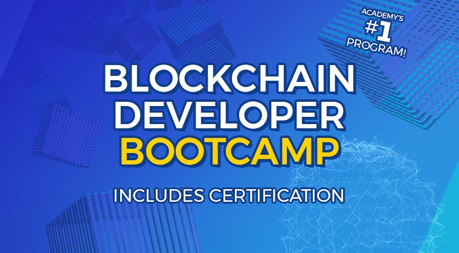
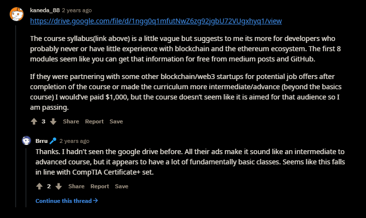

*Thoughts from the trenches of the 2020 cohort...*

 

## Dear Reader

I graduated in late December from the [2020 ConsenSys Blockchain Developer Online Bootcamp](https://consensys.net/academy/bootcamp/), which began in early September and concluded November 30. This was my first bootcamp and I managed to get the certificate, but the road from enrollment to certification proved treacherous (less than 15% of my class succeeded). Thus, I feel obliged to warn those considering joining a future cohort, especially aspiring devs, and I hope the following list will help you weigh the cost.

## Pros

- ***Curation***. News and information in the [cryptocosm](https://blog.blockstack.org/george-gilder-predicts-life-after-google/) is incessant, but ConsenSys expertly curates presentations, lessons, articles, and resources into a clear and cogent briefing on the state of blockchain (Ethereum) development. The mentors also provided the insider scoop [Ethereum 2.0 beacon chain](https://www.coindesk.com/time-to-launch-ethereum-2-beacon-chain) as it was taking place in the middle of our coursework.
  
  Here's the 2020 course sequence:
  1. Review of Blockchain Technology
  2. Blockchain Primitives
  3. Ethereum Basics
  4. Traditional and Decentralized application development
  5. Development Frameworks and Environment
  6. Solidity Fundamentals
  7. Writing Smart Contracts
  8. Ethereum and the End User
  9. Smart Contracts, Pitfalls, Testing, and Debugging
  10. Advanced Topics
  11. Additional Topics
  12. Final Project
  
  As shown by the [2018 syllabus](https://drive.google.com/file/d/1ngg0q1mfutNwZ6zg92jgbU72VUgxhyq1/view), my cohort was a rinse 'n' repeat, but I learned a lot. A few tools mentioned in the initial 2018 material had deprecated (LLL and Vyper), but that's to be expected in a rapidly evolving field like Ethereum and I enjoyed brushing up on its history.
  
- ***Tech stack workflow***. [Truffle](https://www.trufflesuite.com/truffle), [Ganache](https://www.trufflesuite.com/ganache), [MetaMask](https://metamask.io/), [Infura](https://infura.io/), [Remix](https://remix.ethereum.org/#optimize=false&runs=200&evmVersion=null), [MythX](https://mythx.io/). After several mergers, the bootcamp not only offers hands-on experience with the best-in-class Ethereum tech stack, but guidance from its core developers. With Truffle's [Pet Shop Tutorial](https://www.trufflesuite.com/tutorials/pet-shop), two practice projects, and the final project, I got to experience developing and deploying [at least four solid dapps](https://github.com/jun-sung/consensys-dev-bootcamp) from the ground up.

- ***GitHub projects***. For someone who had no previous experience with Git besides [The Odin Project](theodinproject.com/), the bootcamp was also a crash course on GitHub, especially via the final project. After my initial submission, my grader provided [examples](https://github.com/MatricksDeCoder/Fojini-DEX) of well-done projects that taught me how to draft a good README, organize my repo, and troubleshoot. This also opened up a rabbithole for checking out the [starred repos](https://github.com/jun-sung?tab=stars) that better devs have their eye on.

- ***[The certificate](https://courses.consensys.net/certificates/w9trgfa8fa)***.

## Cons

- ***Class size***. My cohort ballooned to a size of over 300 students before settling a little over 280. While that nets ConsenSys a breezy $250k, you can imagine the chaos on Slack. Though the mentors heroically attempted to answer all questions, there was so much noise and I ended up avoiding the platform altogether.

- ***Swindling***. ConsenSys' selling point is to use its clout (["the Microsoft of crypto"](https://www.reddit.com/r/ethereum/comments/b45zov/consensys_academys_developer_bootcamp_is_back/ej4mimo?utm_source=share&utm_medium=web2x&context=3)) to back their certificates upon the successful completion of the bootcamp. As seen in this [thread](https://www.reddit.com/r/ethdev/comments/8jwfv5/general_feeling_about_consensys_academy/), there seems to be legitimate confusion as to who will benefit from the bootcamp: 
   
  
  The fine print recommended at least a year of coding experience, but invited anyone interested in learning more about Ethereum with a full tuition refund if you dropout within the first two weeks. They recommend a pace of a chapter per week, but there's no coding til Chapter 7. The course progresses naturally enough, building upon the foundations laid by each previous chapter. I've been coding on-and-off for several years and my sensation of progressing through Chapters 1-11 was of a gradual climb through Solidity concepts. I was making good progress and managed to successfully complete the practice exercises; and as an aspiring dev, this felt encouraging-- that is, before I hit the sheer rock face of the last chapter. What ConsenSys fails to mention until the very end, long after the two week trial period, and buried in page 6 of the [final project grading rubric](https://docs.google.com/document/d/1fSiejecMogc2h7aJxIl9tfZbHRFXTipftWLevUKAmQ4/edit): 
  > **A note on project difficulty**: 
  > 
  > Depending on your current web development skill level, this project may be more or less difficult.
  
  Now in order to get the certificate, one must submit a working project since it constitutes 55% of the course grade. [My final project](https://github.com/jun-sung/doge-emporium) currently consists of 3% Solidity and 95% JavaScript, so unless you have a good handle of JS (or know someone who does) the likelihood of passing merely with ConsenSys' Solidity lessons is astronomically low. To give you an idea of how many were rudely surprised by this: of the ~280 in my cohort, only 42 of us (~15%) submitted our projects by the deadline. (And who knows how many of those even passed?) 
  
- ***Secret certificate***. While conversing with the grader of my final project, I asked if/when I needed to resolve the issues he flagged on my project repo. He replied saying that resolving the issues will enable me to get the ConsenSys certificate of proficiency apart from their certificate of completion. Meaning, there are **TWO** certificates though this is not mentioned anywhere in the course, rubric, or Slack. I received the one for completion and resolved the issues flagged by my grader, but this was done around Christmas, and he has yet to get back to me in 2021 about whether I can attain the second certificate.

## Advice

- ***Finish [CryptoZombies](https://cryptozombies.io/en/course/)***. I worked through the [CryptoZombies](https://cryptozombies.io/en/course/) Beginner to Intermediate lessons after the bootcamp and am now finishing the Advanced lessons, but I wish I'd done this material beforehand! The course is free and goes through the bulk of what ConsenSys teaches on Solidity in an un-tedious manner, which will allow you to understand concepts and finish the course quickly, affording you precious time to work on your final project.

- ***Focus on the final project***. Whether a seasoned dev or a newbie, the most sensible thing to do is to carve out as much time as possible to work on the final project. First, you need it to work and hit [all the requirements](https://docs.google.com/document/d/1fSiejecMogc2h7aJxIl9tfZbHRFXTipftWLevUKAmQ4/edit) to pass; second, ConsenSys is looking for talent and the final project is the best way to get their notice if you're interested in work/career opportunities. (This [student](https://github.com/astarinmymind) landed an internship with [MetaMask](https://metamask.io/).) I decided I could juggle the bootcamp, full-time work, and prep for the [IRS Enrolled Agent (EA)](https://www.prometric.com/test-takers/search/irs) exams... and only managed to do so by the skin of my teeth. If I were to do it over again, I'd attempt the course with no urgent and competing priorities on the horizon, and *especially not* during the holiday season.

- ***Know JavaScript***. I think JavaScript is as essential as Solidity, if not more so in developing dapps. [CryptoZombies](https://cryptozombies.io/en/course/) affirms that the accepted conventions for smart contract testing is in JS. You can [see for yourself](https://github.com/jun-sung?tab=stars) the Solidity to JS ratio of other students' final projects. While the first 11 chapters of the bootcamp could be finished in 2 weeks (that's what the abovementioned [MetaMask intern](https://github.com/astarinmymind) managed to do), spending the remaining time scrambling to learn enough JS in order to build a passing project isn't ideal.

If you have burning questions, you can reach me at [jun@junsung.io](jun@junsung.io).

## CODA
> **The fool knows after he's suffered.**
>
> Hesiod
