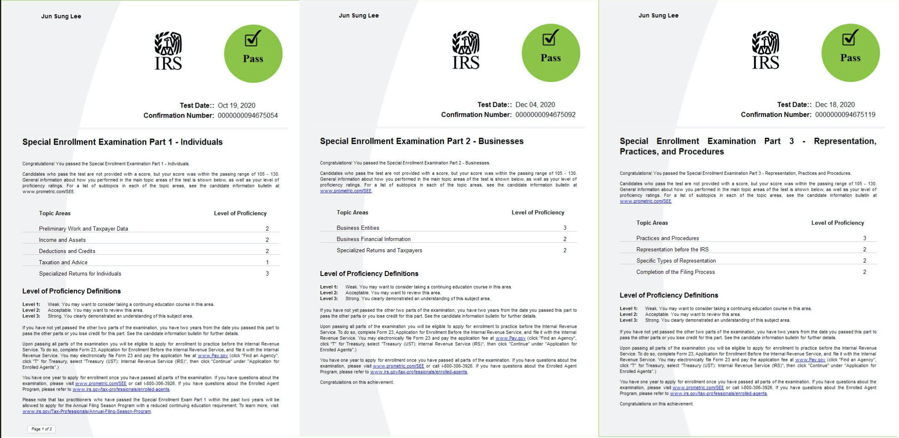
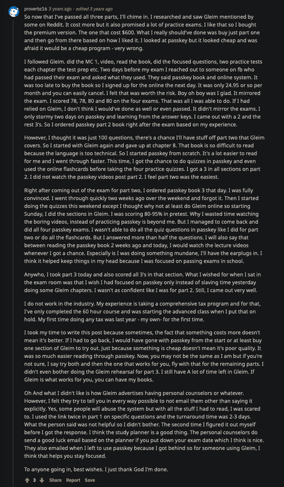

*There and back again…*

 

## Dear Reader

On February 12, in the midst of Seattle’s snow storm of the century, USPS heroically delivered the news that I’d become an IRS Enrolled Agent (EA). The road to obtaining this license is psychologically taxing due to having to familiarize oneself with Circular 230 (US Tax Law), which quickly reveals its kinship to the nine-headed hydra of olde. I also believe the EA is not well-known and therefore not well-understood, so I hope the following will help those considering their services as well as encourage those who are preparing for the exams. 

\* *If you'd like me to help you with taxes or the IRS, you can reach me at* <jun@junsung.io>.

---

### A byte of backstory

My boss offered to finance my EA license after the 2020 tax season. Unfortunately, his offer came a day or two after I’d enrolled in the [ConsenSys Blockchain Developer Bootcamp](https://junsung.io/ConsenSys-Blockchain-Developer-Bootcamp/), so studying for the Special Enrollment Exams (SEE) began in tandem with the bootcamp. Fortunately, the IRS was so fantastically backlogged from not working during Covid that all of our clients’ filing extensions (including quarterly payments, audit follow-ups, etc.) had been sitting unopened in their mailroom. We soon learned that the IRS refused to halt their automated serving of penalties despite not reading their mail and ignoring our repeated attempts to stop them. Thus, this bureaucratic ineptitude resulted in client after client calling to know why they’d paid all this money to our firm who'd failed to do something as simple and prudent as filing an extension. I noticed an immediate graying in my boss's hair. Normally, I'd be helping him untangle such a crisis, but nay-- only attorneys, CPAs, and EAs are allowed to correspond with the IRS. Hence, my boss not only financed my way to becoming an EA, but even offered to let me study for my exams during work hours if I agreed to attempt all three parts of the SEE within a 3 month window. Needless to say, such an offer is difficult to refuse.

## FAQs

I hope you've gleaned from the aformentioned story that
- An EA is one of three licensed practitioners who may represent a client before the IRS, and that 
- The candidate must past a three-part exam known as the SEE. 
- While attorneys and CPAs are registered to practice within their home state, the EA has *unlimited rights*-- meaning, the EA is the most flexible in fighting the US Tax hydra regardless of locale. Thus,
- **I believe the EA is advantageous for tax legalities within remote teams and organizations**. 

## SEE Prep Advice

I began my studies in September 2020 using [Gleim's EA Review](https://www.gleim.com/enrolled-agent-review/), taking exams 1-3 on Oct 19, Dec 4, and Dec 18 respectively. 

  

SEE-1 tests on Individual returns, SEE-2 on Business, and SEE-3 covers Client Representation (Ethics). [Gleim recommends](https://www.gleim.com/enrolled-agent-review/blog/ea-exam-study-schedule-tcja/) setting aside 8 weeks each for SEE 1-2, and 6 weeks for SEE-3; and as the exams can be taken in any order, [Reddit advises](https://www.reddit.com/r/taxpros/comments/7nx16x/how_long_did_it_take_to_pass_the_ea_exam/) taking part3 (considered easiest), followed by part1 and part2 (the toughest). 

This is essentially the snowball effect: getting small wins under your belt, which will motivate you in tackling bigger challenges and eventually finishing strong. [Gleim also recommends](https://www.gleim.com/enrolled-agent-review/blog/ea-exam-study-schedule-tcja/) taking the SEE in sequence since each successive part builds upon the one before. Now I agree that SEE 1-2 have many overlapping parts, but one should be wary about about the supposed easiness of SEE-3 as I felt that part to be unnecessarily tricky with the questions being insidiously worded. This Redditor had a similar experience:

  

Perhaps this is to get us all used to the idea that rather than being straightforward, the IRS prefers psychological jujitsu.

### Using Gleim

[Gleim's material](https://www.gleim.com/enrolled-agent-review/) is some of the driest reading I've come across, but each section has been methodically prepared to cover all bases. Their selling point is their large test bank and I found it useful as their tests are formatted to be identical to the one you'll be encountering at a Prometric testing site, except in one regard, which I'll describe below. 

As you'll have little idea of what the testing experience is like, it's important to feel as prepared as possible for the first exam. After your first victory, I think you'll settle into a groove, having developed better intuition on what/how to study.

### Prometric Testing

If you find your nerves fraying, you can sign up for a [mock run](https://www.prometric.com/test-takers/search/irs), though I can't recommend spending any more time at these testing centers than necessary. Perhaps your locale is more friendly; mine was a little corner of hell.

Now the aspect that Gleim did not prepare me for was the fact that the actual exam is in two parts. The Gleim practice exam consists of 100 questions to be completed in 3hrs, but the actual exam is 2hrs 45mins without the possibility of returning to the first fifty questions if you begin working on the latter half. My strategy was to give myself roughly 1hr 30mins on the first half, combing through every question at least 3 times before moving to the second half. It's painful to find a hint to one of the troublesome questions from the first half in the second. 

If you're taking the SEE, I hope you experience the same gratitude I felt to my God for passing each exam on the first run. 

### Not Using Gleim

An alternate route:

  

### Post-Exam

The careful reader might've noticed that I completed the SEE in December, but didn't receive the news of my enrollment til February. One does not simply become enrolled after the exams; the IRS can deny your application they find your background and tax history questionable. So after coughing up the application fee, the IRS performs a minor audit and you learn to empathize with future clients.

You can reach me with any burning questions at [jun@junsung.io](jun@junsung.io).

---

## CODA

*If you have been having trouble with the tax authorities and you receive an official piece of mail from their agency, your blood pressure will increase or drop precipitously. Your heart will pound, your palms will sweat, and a feeling of intense fear (even doom) will sweep over you.* 

-- Jordan B. Peterson, [*Beyond Order*](https://www.amazon.com/Beyond-Order-More-Rules-Life/dp/0593084640)
