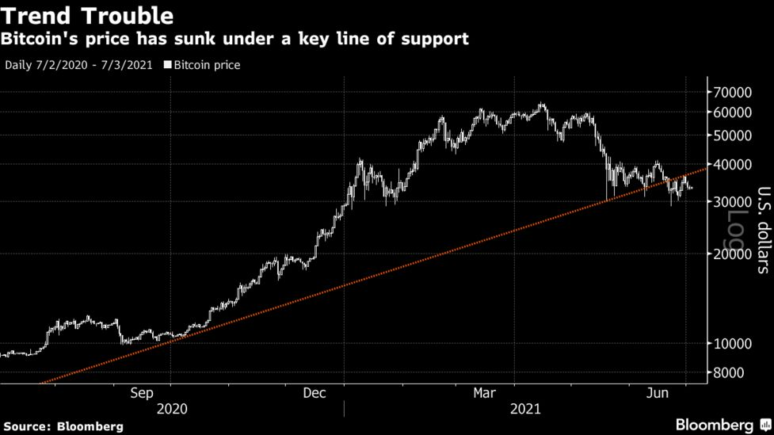

_These aren't the droids you're looking for..._

## Dear Reader

In a
[January 2021 talk](https://podcasts.apple.com/us/podcast/the-silver-lining-peter-thiel-in-2021/id1527549379?i=1000513763854),
Peter Thiel said investing in Bitcoin is the equivalent of following Jim
Cramer's 2013 advice -- to bet on FAANG.

In a [March 2021 interview](https://tim.blog/2021/03/24/balaji-srinivasan),
Balaji Srinivasan said splitting an investment 50/50 between Bitcoin and
Ethereum would be the quick and dirty way of making the most bang for your buck.

Thus spoke the angels, but here's my thoughts on why Bitcoin is a particularly
bad investment for us Americans.

---

## Bitcoin is not our fiat

Let's survey the field: cryptocurrencies are competing to replace the dollar.
For years, certain strips of paper were, and still are, abracadabra'd to legal
tender by the Federal Reserve; thus, it makes some sense to exchange inked plant
fiber for a purely digital token. And the uncontrolled money-printing released
by the dollar's unmooring from the gold standard has borne the hydra of
exponential debt, presenting an opportunity for a certain token to rise to the
occasion.

I believe George Gilder correctly teaches that **a cryptocurrency must mimic
gold's two paradoxical facets to secure fiat status: perpetual supply and
constant difficulty of acquisition**. Why? New deposits continue to be
discovered and rewarded to fresh generations of seekers, but the ore remains
just as difficult to get our grubby mitts on as it was 8,000 years ago. Broadly,
the mystery of gold invites success to anyone willing to work for it; Bitcoin
fails the test as its total supply is capped at 21 million BTC and, as of
writing, roughly 2 million BTC remain (effectively 90% exhausted). Thus, Bitcoin
was a purely speculative asset from the beginning; once the final coin is mined,
I doubt it'll enjoy as fortunate a legacy as the Beanie Baby.

The horse to support in this race is Ethereum... but that's another post.

## Byzantium

The overthrow of the dollar will clearly signal the end of American hegemony,
but the blare of crypto hype, speculation, and greed distracts us from clearly
discerning such a future and its implications. [^1]

Bitcoin began January 3, 2009 and is 90% exhausted 12 years later. The prospect
of holding "for the long haul" or in hopes of beating the inflating dollar now
is foolish. An oft forgotten function of bitcoin price is halving miner rewards
every four years. The last halving was May 2020, changing the mining reward from
$12.50 to $6.25. With each halving, the cost of mining doubles, and
profitability requires more efficient mining and a higher bitcoin price. [^2]

Joel Salatin shrewdly observed that a dollar saved is actually $1.12 due to not
paying taxes on it. But suppose we invested $1 in BTC last July: it would be
$3.53 today (a cool 253% gain). And let's adjust for 5% dollar inflation
(-$0.18) from 2020-2021, long-term capital gains rate of 15% (-$0.53), doubled
miner's fees, exchange fees (variable upon market volatility), ATM fees, etc.
We'd be fortunate to get our dollar back!

Does your local grocery store accept bitcoin? Does Amazon? Granted, we may now
use BTC to get a
[mortgage](https://www.coindesk.com/us-mortgage-lender-uwm-plans-to-accept-bitcoin-payments)
and/or
[Tesla](https://www.fool.com/the-ascent/cryptocurrency/articles/musk-says-tesla-will-accept-bitcoin-payments-again-but-theres-a-catch/),
but unless the Fed recognizes BTC as fiat (SPOILER: it won't), BTC cannot be
used as actual currency in transactions for goods and services; it merely exists
as an asset taxed solely for the benefit of the State. And what of the billions
being poured into BTC by central banks? Due to BTC being a fixed pie, those with
the most coin can manipulate the market to their advantage.

**In sum, BTC is neither an actual currency that can be used in transactions for
goods/services or a sound investment vehicle that will outmaneuver federal
predation.**

You can reach me with any thoughts or questions at <jun@junsunglee.com>.

---

## CODA

_A purely peer-to-peer version of electronic cash would allow online payments to
be sent directly from one party to another without going through a financial
institution._

-- Satoshi Nakamoto,
[_Bitcoin: A Peer-to-Peer Electronic Cash System_](https://bitcoin.org/bitcoin.pdf)

---

[^1]:
    _As she glorified herself and lived in luxury, so give her a like measure of
    torment and mourning, since in her heart she says, ‘I sit as a queen, I am
    no widow, and mourning I shall never see.’ For this reason her plagues will
    come in a single day, death and mourning and famine, and she will be burned
    up with fire; for mighty is the Lord God who has judged her.” And the kings
    of the earth, who committed sexual immorality and lived in luxury with her,
    will weep and wail over her when they see the smoke of her burning.They will
    stand far off, in fear of her torment, and say, “Alas! Alas! You great city,
    you mighty city, Babylon! For in a single hour your judgment has come.” And
    the merchants of the earth weep and mourn for her, since no one buys their
    cargo anymore, cargo of gold, silver, jewels, pearls, fine linen, purple
    cloth, silk, scarlet cloth, all kinds of scented wood, all kinds of articles
    of ivory, all kinds of articles of costly wood, bronze, iron and marble,
    cinnamon, spice, incense, myrrh, frankincense, wine, oil, fine flour, wheat,
    cattle and sheep, horses and chariots, and slaves, that is, human souls.
    “The fruit for which your soul longed has gone from you, and all your
    delicacies and your splendors are lost to you, never to be found again!” The
    merchants of these wares, who gained wealth from her, will stand far off, in
    fear of her torment, weeping and mourning aloud, “Alas, alas, for the great
    city that was clothed in fine linen, in purple and scarlet, adorned with
    gold, with jewels, and with pearls! For in a single hour all this wealth has
    been laid waste.” And all shipmasters and seafaring men, sailors and all
    whose trade is on the sea, stood far off and cried out as they saw the smoke
    of her burning, “What city was like the great city?” And they threw dust on
    their heads as they wept and mourned, crying out, “Alas, alas, for the great
    city where all who had ships at sea grew rich by her wealth! For in a single
    hour she has been laid waste._ (Revelation 18:7-19) [^2]: Michael Kendall,
    [_Bitcoin through $30,000_](https://manonthemargin.com/bitcoin-through-30000/)

\* Image credit:
[Unsplash](https://unsplash.com/s/photos/bitcoin?utm_source=unsplash&utm_medium=referral&utm_content=creditCopyText)
